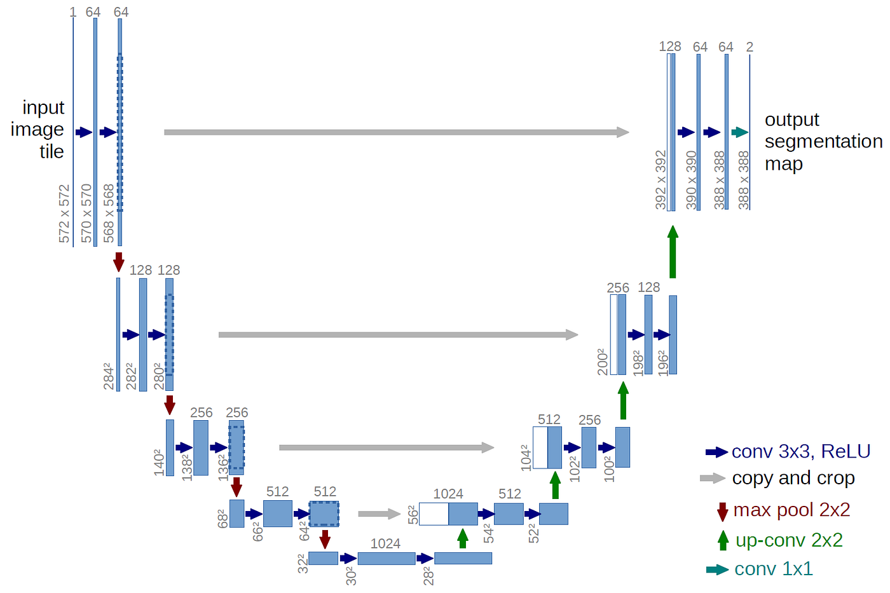
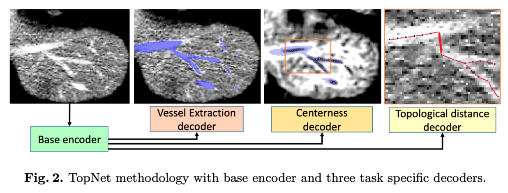

# Contraintes topologiques pour la segmentation vasculaire par apprentissage profond

## Description du Projet

La segmentation manuelle d’images médicales est une pratique très courante en milieu hospitalier. Cependant, celle-ci est fastidieuse, redondante, et soumise à un fort biais inter-experts. Dans un objectif d’optimisation, de libération de temps pour les soignants et d’uniformisation, la segmentation automatique est l'un des principaux enjeux actuels de deep-learning. En effet, pouvoir modéliser les organes avec précision serait un grand atout pour la planification de chirurgie, le suivi thérapeutique ou la pose de diagnostic. On cherche alors à développer une méthode automatisée de délimitation des vaisseaux sanguins. Dans le cas du foie, on souhaite segmenter l’arbre vasculaire hépatique en mettant l’accent sur la préservation des petites structures à topologie complexe.  

## Méthodes
### UNet

**U-Net : convolutional networks for biomedical image segmentation**

*O. Ronneberger et al.*

### TopNet

**TopNet : Topology preserving metric learning for vessel tree reconstruction and labeling**

*D. Keshwani et al.*

### ClDice

**Beyond the pixel-wise loss for topology-aware delineation**

*A. Mosinska et al.*

### Features Maps

**clDice - A Novel Topology-Preserving Loss Function for Tubular Structure Segmentation**

*S. Shit et al.*

## Ressources
### Introduction
- [Sujet de projet](https://filesender.renater.fr/?s=download&token=142d0ae0-d553-4809-89c7-8ed28e8dcef4)
- [Tutorial MONAI UNet](https://github.com/Project-MONAI/tutorials/blob/main/3d_segmentation/spleen_segmentation_3d.ipynb)
- [Introduction aux réseaux convolutifs (vidéo cours Standford)](https://www.youtube.com/watch?v=bNb2fEVKeEo) 
- [Deep Learning with PyTorch: A 60 Minute Blitz](https://pytorch.org/tutorials/beginner/deep_learning_60min_blitz.html) 
- [Learn PyTorch for Deep Learning: Zero to Mastery book](https://www.learnpytorch.io) 

### Etat de l'art
- [O. Ronneberger et al. « U-Net : convolutional networks for biomedical image segmentation »](https://arxiv.org/pdf/1505.04597.pdf)
- [D. Keshwani et al., « TopNet : Topology preserving metric learning for vessel tree reconstruction and labeling »]( https://arxiv.org/pdf/2009.08674.pdf)
- [X. Zhang et al. « An Anatomy- and Topology-Preserving Framework for Coronary Artery Segmentation » (merci de ne pas diffuser)](https://filesender.renater.fr/?s=download&token=d8a0ea5f-cb9e-4c1e-9c9d-56af93924164) 
- [A. Mosinska et al. « Beyond the pixel-wise loss for topology-aware delineation »](https://openaccess.thecvf.com/content_cvpr_2018/papers/Mosinska_Beyond_the_Pixel-Wise_CVPR_2018_paper.pdf)
- [S. Shit et al. « clDice - A Novel Topology-Preserving Loss Function for Tubular Structure Segmentation »](https://arxiv.org/pdf/2003.07311.pdf) 
- [ Computation of Total Kidney Volume from CT images in Autosomal Dominant Polycystic Kidney Disease using Multi-Task 3D Convolutional Neural Networks, Deepak Keshwani, Yoshiro Kitamura, Yuanzhong Li Imaging Technology Center, Fujifilm Corporation, Japan deepak.keshwani@fujifilm.com](https://arxiv.org/pdf/1809.02268.pdf)
- [Combining deep learning with anatomy analysis for segmentation of portal vein for liver SBRT planning Bulat Ibragimov1, Diego Toesca, Daniel Chang, Albert Koong1, and Lei Xing1 Department of Radiation Oncology, Stanford University School of Medicine, 875 Blake Wilbur Drive, Palo Alto, California 94305](https://www.ncbi.nlm.nih.gov/pmc/articles/PMC5739057/pdf/nihms924944.pdf)
- [VesselNet: A deep convolutional neural network with multi pathways for robust hepatic vessel segmentation Author links open overlay panelTitinunt Kitrungrotsakul a, Xian-Hua Han b, Yutaro Iwamoto a, Lanfen Lin c, Amir Hossein Foruzan d, Wei Xiong e, Yen-Wei Chen a f c](https://www.sciencedirect.com/science/article/abs/pii/S0895611118304099?via%3Dihub)
- [Recurrent Pixel Embedding for Instance Grouping Shu Kong, Charless Fowlkes Department of Computer Science University of California, Irvine Irvine, CA 92697, USA {skong2, fowlkes}@ics.uci.edu](https://arxiv.org/pdf/1712.08273.pdf)
- [ Instance Segmentation and Tracking with Cosine Embeddings and Recurrent Hourglass Networks Christian Payer, Darko Štern, Thomas Neff, Horst Bischof & Martin Urschler ](https://link.springer.com/chapter/10.1007/978-3-030-00934-2_1)
- [Liver vessel segmentation and identification based on oriented flux symmetry and graph cuts](https://www.sciencedirect.com/science/article/abs/pii/S0169260716312196?via%3Dihub)
- [TopNet: Transformer-based Object Placement Network for Image Compositing Sijie Zhu1, Zhe Lin2, Scott Cohen2, Jason Kuen2, Zhifei Zhang2, Chen Chen1 1Center for Research in Computer Vision, University of Central Florida 2Adobe Research sizhu@knights.ucf.edu,{zlin,scohen,kuen,zzhang}@adobe.com,chen.chen@crcv.ucf.edu](https://openaccess.thecvf.com/content/CVPR2023/papers/Zhu_TopNet_Transformer-Based_Object_Placement_Network_for_Image_Compositing_CVPR_2023_paper.pdf)
- [Safetensors serialization by default, DistilWhisper, Fuyu, Kosmos-2, SeamlessM4T, Owl-v2](https://github.com/huggingface/transformers/releases)

### Datasets
- [DRIVE (images de fond d’oeil avec annotation vérité-terrains des vaisseaux) ](https://www.kaggle.com/datasets/andrewmvd/drive-digital-retinal-images-for-vessel-extraction) 
- [IRCAD (images cropées autour du foie puis pre-traitées)](https://drive.google.com/file/d/1XTvTlN2PpCXAxzSYBtct2aLB5H9-UCAf/view?usp=sharing)
—> images sources + annotations vérité-terrains du système veineux porte